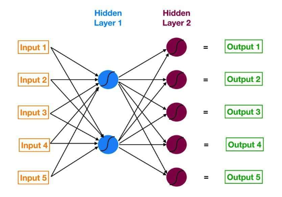

## [Understanding Neural Networks](//pdfs/Understanding%20Neural%20NetworksB.pdf)

신경망의 기본 개념 이해

- 신경망의 개요: 신경망은 여러 층의 뉴런으로 구성된 다층 네트워크이다. 이 네트워크는 사물 분류, 예측 등을 위해 사용된다.
- 신경망의 구성 요소:
  - 입력층, 은닉층, 출력층으로 나뉜다.
  - 입력층은 모델의 입력을 받는 역할을 한다.
  - 은닉층은 입력을 처리하고, 출력층은 최종 예측을 제공한다.
- 데이터 흐름: 데이터는 입력층에서 시작하여 은닉층을 거쳐 출력층으로 이동한다. 이 과정에서 뉴런 간의 연결이 이루어진다.
- 학습 과정: 신경망은 역전파(backpropagation)이라는 과정을 통해 실수를 학습한다. 이 과정은 출력값을 계산한 후, 오류를 역으로 전파하여 가중치를 조정하는 방식이다.


신경망의 구조 설명

- 신경망의 구조: 신경망은 다층의 뉴런으로 구성되어 있으며, 각 뉴런은 입력을 받아 처리한다.
- 다이어그램 설명:
  - 다이어그램에는 5개의 입력, 5개의 출력, 2개의 은닉층이 포함되어 있다.
  - 각 층은 서로 연결되어 있으며, 데이터가 어떻게 이동하는지를 보여준다.
- 뉴런의 역할: 각 뉴런은 입력을 받아 가중치와 바이어스를 적용한 후, 활성화 함수를 통해 출력을 생성한다.
- 출력층: 출력층은 모델의 최종 예측을 제공하며, 이 예측은 입력 데이터에 대한 결과이다.

로지스틱 회귀와 신경망의 연결

- 로지스틱 회귀의 개념: 로지스틱 회귀는 단일 특성을 가진 모델로, 신경망을 통해 표현할 수 있다.
- 신경망과 로지스틱 회귀의 관계:
  - 로지스틱 회귀의 방정식을 신경망의 색상 코드로 재작성할 수 있다.
  - 입력 X는 모델에 제공되는 유일한 특성이다.
- 모델 구성 요소:
  - B1: 로지스틱 회귀의 기울기 매개변수로, X가 변화할 때 로그 오즈가 얼마나 변화하는지를 나타낸다.
  - B0: 바이어스 항으로, 각 뉴런마다 개별적으로 존재한다.
- 활성화 함수: 시그모이드 함수는 로그 오즈를 확률로 변환하는 데 사용된다.

신경망의 복잡성 증가

- 복잡한 신경망 구조: 기본 구조를 바탕으로 더 복잡한 신경망을 살펴본다.
- 은닉층의 뉴런 수: 첫 번째 은닉층은 두 개의 뉴런으로 구성되어 있으며, 입력과의 연결을 위해 10개의 연결이 필요하다.
- 가중치 표기법:
  - W1,1: 입력 1과 뉴런 1 간의 가중치.
  - W1,2: 입력 1과 뉴런 2 간의 가중치.
- 출력 계산: 각 뉴런의 출력을 계산하기 위해 특정 공식을 사용한다. 예를 들어, `Z1 = W1*In1 + W2In2 + ... + Bias_Neuron1.`

신경망의 학습 과정

- 신경망 훈련의 중요성: 신경망의 출력값이 계산된 후, 훈련을 통해 모델을 개선해야 한다.
- 비용 함수 정의: 비용 함수는 예측값과 실제값 간의 차이를 측정하는 데 사용된다.
- 경량 하강법:
  - 경량 하강법을 사용하여 비용 함수를 최소화하는 방향으로 가중치를 조정한다.
  - 각 가중치의 변화가 다른 뉴런에 미치는 영향을 고려해야 한다.
- 모델의 복잡성: 신경망은 여러 개의 뉴런과 연결로 구성되어 있으며, 각 뉴런은 독립적인 모델처럼 작동한다.

비용 함수와 경량 하강법

- 비용 함수의 정의: 비용 함수는 예측의 정확성을 평가하는 데 사용된다. 예를 들어, MSE(Mean Squared Error)는 다음과 같이 정의된다:

  $$
  \text{MSE} = \sum \left[ (\text{Prediction} - \text{Actual})^2 \right] \cdot \left( \frac{1}{\text{num\_observations}} \right)
  $$

- 비용 함수의 역할: MSE는 평균적으로 얼마나 잘못되었는지를 나타내며, 큰 오류에 대해 더 큰 패널티를 부여한다.
- 경량 하강법의 필요성: 경량 하강법을 사용하기 위해서는 비용 함수의 기울기를 알아야 한다.
- 가중치와 바이어스의 상호작용: 신경망에서는 가중치와 바이어스의 변화가 서로에게 영향을 미친다.

역전파의 개념 이해

- 역전파의 정의: 역전파는 신경망에서 오류를 역으로 전파하는 과정이다.
- 신경망의 작동 방식:
  - 입력이 뉴런에 들어가면 가중치와 바이어스를 통해 활성화가 계산된다.
  - 출력층에서 발생한 오류는 다시 뉴런을 통해 전파된다.
- 오류 계산의 중요성: 각 뉴런의 오류를 계산하는 것은 가중치와 바이어스를 조정하는 데 필수적이다.
- 신경망의 최적화: 오류의 크기는 해당 뉴런의 출력이 비용 함수에 미치는 영향을 나타낸다.

신경망의 오류 전파 과정

- 오류 전파의 목적: 각 뉴런의 오류를 계산하여 가중치와 바이어스를 조정하는 것이다.
- 활성화와 오류의 관계: 활성화가 높은 뉴런은 오류가 클 가능성이 높다.
- 가중치 조정의 필요성: 오류가 큰 뉴런의 가중치와 바이어스를 조정하는 것이 중요하다.
- 신경망의 최적화 과정: 오류를 통해 각 뉴런의 기여도를 평가하고, 이를 바탕으로 가중치를 조정한다.

신경망의 학습 최적화

- 최적화 과정 요약:
  - 현재 위치에서 기울기를 계산한다.
  - 각 매개변수를 기울기에 비례하여 수정한다.
  - 새로운 매개변수 값으로 기울기를 다시 계산하고, 이 과정을 반복한다.
- 기울기의 정의: 기울기는 각 매개변수에 대한 비용 함수의 편미분으로 구성된다.
- 최소화 목표: 비용 함수를 최소화하기 위해 각 매개변수를 조정하는 것이 목표이다.
- 신경망의 복잡성: 많은 가중치와 바이어스가 상호작용하므로, 최적화 과정이 복잡해진다.

신경망의 독특한 특성

- 신경망의 장점: 각 뉴런은 독립적인 모델로 작동하며, 서로 연결되어 더 복잡한 관계를 학습할 수 있다.
- 비선형 관계 학습: 신경망은 데이터의 비선형 부분을 잘 학습할 수 있다.
- 과적합 방지: 모델이 새로운 데이터에 대해 잘 작동하도록 정규화를 고려해야 한다.
- 효율적인 학습: 여러 개의 모델이 서로 연결되어 있어, 데이터로부터 학습하는 방식이 다른 알고리즘보다 뛰어나다.

## [CNN vs. RNN vs. ANN – Analysing 3 Types of Neural Networks in Deep Learning](/pdfs/CNN%20vs.%20RNN%20vs.%20ANN%20–%20Analysing%203%20Types%20of%20Neural%20Networks%20in%20Deep%20Learning.pdf)

딥러닝의 필요성

- 딥러닝의 중요성: 데이터 과학자가 딥러닝 알고리즘을 선택해야 하는 이유에 대한 질문이 제기된다.
- 기계 학습 알고리즘의 한계: 전통적인 기계 학습 알고리즘과 비교했을 때, 딥러닝 알고리즘이 제공하는 이점이 있다.
- 컴퓨팅 파워: 딥러닝 알고리즘은 많은 컴퓨팅 파워를 요구하지만, 그 사용이 가치가 있다는 점이 강조된다.
- 딥러닝의 응용: 자율주행차, 음성 인식 등 다양한 분야에서 딥러닝이 혁신을 이끌고 있다.

기계 학습과 딥러닝 비교

- 결정 경계: 모든 기계 학습 알고리즘은 입력과 출력 간의 매핑을 학습한다.
  - 파라메트릭 모델: 함수와 몇 개의 가중치 집합을 통해 학습한다.
  - 비선형 데이터: 로지스틱 회귀의 경우, 선형 결정 경계를 학습할 수 있지만 비선형 데이터는 처리할 수 없다.
- 기계 학습의 한계: 모든 기계 학습 알고리즘이 복잡한 관계를 학습할 수 있는 것은 아니다.
- 딥러닝의 장점: 딥러닝은 복잡한 관계를 학습할 수 있는 능력이 있다.

특징 공학의 중요성

- 특징 공학의 정의: 모델 구축 과정에서 중요한 단계로, 두 가지 단계로 나뉜다.
  1. 특징 추출: 문제 진술에 필요한 모든 특징을 추출하는 과정이다.
  2. 특징 선택: 모델 성능을 향상시키는 중요한 특징을 선택하는 과정이다.
- 이미지 분류 문제: 수동으로 특징을 추출하는 것은 시간 소모가 크고 전문 지식이 필요하다.
- 딥러닝의 자동화: 딥러닝 덕분에 특징 공학 과정을 자동화할 수 있다.

인공 신경망(ANN) 소개

- ANN의 정의: 인공 신경망은 여러 개의 퍼셉트론(또는 뉴런)으로 구성된 네트워크이다.
- 구조: ANN은 입력층, 은닉층, 출력층으로 구성된다.
  - 입력층: 입력을 수용하는 역할을 한다.
  - 은닉층: 입력을 처리하는 역할을 한다.
  - 출력층: 결과를 생성하는 역할을 한다.
- 적용 분야: ANN은 표 형식 데이터, 이미지 데이터, 텍스트 데이터 문제를 해결하는 데 사용된다.

인공 신경망의 장점과 도전 과제

- 비선형 함수 학습: ANN은 비선형 함수를 학습할 수 있는 능력이 있다.
  - 유니버설 함수 근사기: ANN은 모든 입력을 출력으로 매핑할 수 있는 능력을 가진다.
- 활성화 함수의 중요성: 활성화 함수는 네트워크에 비선형 특성을 도입하여 복잡한 관계를 학습할 수 있도록 한다.
- 도전 과제: 이미지 분류 문제에서 2차원 이미지를 1차원 벡터로 변환해야 하며, 이는 훈련 가능한 매개변수의 수를 증가시킨다.
- 기타 문제: 모든 신경망에서 발생할 수 있는 소실 및 폭발하는 기울기 문제가 있다.

순환 신경망(RNN) 소개

- RNN의 정의: RNN은 ANN의 은닉층에 루프 제약이 있는 구조이다.
- 순차 정보 캡처: RNN은 입력 데이터의 순차 정보를 캡처할 수 있다.
- 적용 분야: RNN은 시계열 데이터, 텍스트 데이터, 오디오 데이터 문제를 해결하는 데 사용된다.

순환 신경망의 장점과 도전 과제

- 장점: RNN은 입력 데이터의 순차적 정보를 캡처하여 예측을 수행한다.
- 파라미터 공유: RNN은 서로 다른 시간 단계에서 파라미터를 공유하여 훈련할 매개변수 수를 줄이고 계산 비용을 감소시킨다.
- 도전 과제: 깊은 RNN은 소실 및 폭발하는 기울기 문제를 겪는다.

합성곱 신경망(CNN) 소개

- CNN의 정의: CNN은 현재 딥러닝 커뮤니티에서 매우 인기 있는 모델이다.
- 필터의 역할: CNN의 기본 구성 요소는 필터(또는 커널)로, 입력에서 관련 특징을 추출하는 데 사용된다.
- 응용 분야: CNN은 이미지 및 비디오 처리 프로젝트에서 특히 두드러진 성과를 보인다.

합성곱 신경망의 장점

- 자동 필터 학습: CNN은 필터를 자동으로 학습하여 입력 데이터에서 적절한 특징을 추출한다.
- 공간적 특징 캡처: CNN은 이미지의 픽셀 배열과 그들 간의 관계를 캡처하여 객체를 정확하게 식별할 수 있다.
- 파라미터 공유: CNN은 입력의 여러 부분에 걸쳐 동일한 필터를 적용하여 특징 맵을 생성한다.

신경망 유형 비교

- 비교 요약: 다양한 신경망 유형 간의 차이점을 요약하여 제시한다.

## [Neural Network Concepts Animations](https://nnfs.io/neural_network_animations)

## [Neural Network Architecture](./pdfs/Neural%20Network%20Architecture.pdf)

신경망 아키텍처 개요

- 입력층: 입력층은 초기 데이터를 수신하는 역할을 한다. 이 데이터는 숫자, 텍스트 또는 이미지 기반일 수 있다.
  - 입력층의 뉴런 수는 입력 데이터의 차원에 해당한다.

은닉층의 역할

- 은닉층: 은닉층은 입력층과 출력층 사이의 중간층이다.
  - 이 층은 신경망이 복잡한 패턴과 표현을 학습할 수 있도록 한다.
  - 은닉층의 수와 각 층의 뉴런 수는 문제의 복잡성과 사용 가능한 데이터에 따라 달라진다.

출력층의 기능

- 출력층: 출력층은 학습된 패턴을 기반으로 최종 결과 또는 예측을 생성한다.
  - 출력층의 뉴런 수는 문제 유형에 따라 다르며, 예를 들어 이진 분류, 다중 클래스 분류 또는 회귀 문제에 따라 결정된다.

신경망 구축 단계

- 신경망 구축: Python에서 신경망을 구축하기 위해 다음과 같은 주요 단계를 따른다.
  - 데이터 준비:
    - 훈련 및 평가를 위한 데이터를 수집하고 전처리한다.
    - 데이터를 훈련 세트와 테스트 세트로 분할하며, 문제 도메인의 적절한 표현을 보장한다.

모델 아키텍처 설정

- 모델 아키텍처:

  - 입력 특성의 수와 원하는 출력 형태를 결정한다.
  - 은닉층의 수와 각 층의 뉴런 수를 선택하고, 각 층에 적합한 활성화 함수를 선택한다.

- 활성화 함수의 종류
- 활성화 함수: 활성화 함수는 신경망에 비선형성을 도입하여 복잡한 관계를 학습하고 예측할 수 있도록 한다.
  - 일반적으로 사용되는 활성화 함수:
    - Sigmoid: 입력을 0과 1 사이의 값으로 매핑하여 이진 분류 문제에 적합하다.
    - ReLU (Rectified Linear Unit): 모든 음수 입력을 0으로 설정하고 양수 입력은 그대로 유지한다. 이는 은닉층에서 비선형성을 도입하고 기울기 소실 문제를 해결하는 데 널리 사용된다.
    - Softmax: 다중 클래스 분류 작업의 출력층에서 일반적으로 사용되며, 출력을 확률로 변환하여 합이 1이 되도록 한다.

모델 컴파일 과정

- 모델 컴파일:
  - 손실 함수를 지정하여 모델의 성능을 측정한다.
  - 최적화 알고리즘: Stochastic Gradient Descent (SGD)와 같은 최적화 알고리즘을 선택하여 훈련 중 모델의 가중치를 업데이트한다.
  - 모델의 정확도나 성능을 측정하기 위한 평가 지표를 정의한다.

모델 훈련 방법

- 모델 훈련:
  - 훈련 데이터를 신경망에 공급하고 여러 에포크를 통해 반복한다.
  - 역전파: 손실 함수의 기울기를 계산하여 가중치를 조정하고, 손실 함수를 최소화하여 모델의 성능을 향상시킨다.

모델 평가 및 조정

- 모델 평가:
  - 테스트 데이터를 사용하여 모델의 성능을 평가한다.
  - 평가 지표: 정확도, 정밀도, 재현율 또는 F1 점수와 같은 평가 지표를 계산하여 모델의 효과성을 측정한다.
  - 평가 결과에 따라 모델을 반복적으로 조정하고 미세 조정한다.

## [Activation Functions](./pdfs/Activation%20Functions.pdf)

신경망의 활성화 함수 개요

- 활성화 함수는 신경망에서 중요한 역할을 하며, 숨겨진 층에서 복잡한 문제를 해결하고 데이터를 분석 및 전송하는 기능을 수행한다.
- 다양한 활성화 함수가 존재하며, 여기에는 이진, 선형, 그리고 여러 비선형 변형이 포함된다.
- 활성화 함수는 기계 학습, 딥 뉴럴 네트워크, 인공 신경망에서 특정 입력 집합에 따라 노드의 출력을 정의한다.
- 활성화 함수는 알고리즘 네트워크가 우선 문제에 집중할 수 있도록 입력을 분리하여 처리 능력을 효과적으로 사용할 수 있도록 한다.

활성화 함수의 필요성

- 신경망에서 활성화 함수는 필수적이다. 활성화 함수가 없으면 모델의 출력은 단순히 입력의 선형 함수가 된다.
- 즉, 복잡한 데이터를 처리할 수 없게 된다.
- 활성화 함수는 각 전방 전파 층에서 추가적인 단계이지만, 이는 매우 가치 있는 단계이다.
- 비선형성이 없으면 신경망은 단순한 선형 회귀 모델로만 작동하게 된다.

신경망 아키텍처의 기본 요소

- 활성화 함수의 역할을 이해하기 위해서는 신경망 아키텍처의 기본 요소를 이해하는 것이 중요하다.
- 신경망의 아키텍처는 세 가지 핵심 층으로 구성된다:
  - 입력 층: 원시 데이터/데이터셋을 수신하는 층이다.
  - 숨겨진 층: 데이터가 여러 비선형 뉴런과 활성화 함수에 의해 처리되는 층이다.
  - 출력 층: 입력 데이터와 숨겨진 층을 통해 처리된 결과를 바탕으로 최종 계산, 예측 또는 분류를 생성하는 층이다.

입력 및 숨겨진 층 설명

- 입력 층은 데이터가 들어오는 단순한 게이트 역할을 하며, 이 단계에서는 복잡한 계산이 이루어지지 않는다.
- 숨겨진 층은 복잡하고 고급 신경망에서 하나 이상의 층을 포함하며, 각 뉴런과 활성화 함수는 특정 역할을 수행한다.
- 이 층에서의 결과는 출력 층으로 전달되며, 모델 성능과 출력을 개선하기 위한 최적화가 이루어질 수 있다.

출력 층의 역할

- 출력 층은 입력 데이터와 숨겨진 층을 통해 처리된 결과를 바탕으로 최종 계산, 예측 또는 분류를 생성한다.
- 이 층에서 사용되는 활성화 함수는 일반적으로 숨겨진 층에서 사용되는 것과 다르며, 선택은 프로젝트 관리자가 원하는 목표나 예측 유형에 따라 달라진다.

활성화 함수의 유형

- 활성화 함수는 일반적으로 세 가지 주요 범주로 분류된다:
  1. 이진 단계: 입력이 특정 임계값을 초과하는지 여부에 따라 이진 출력을 생성한다.
  2. 선형: 출력이 입력에 비례하는 간단한 함수이다.
  3. 비선형: Sigmoid, Tanh와 같은 복잡한 함수로, 모델에 비선형성을 도입한다.
- 각 활성화 함수는 해결해야 할 특정 문제와 도전에 따라 선택된다.

선형 활성화 함수의 세부사항

- 선형 활성화 함수는 출력이 입력 신호와 동일하게 유지되도록 사용된다.
- 이 함수는 미분 가능하며, 신호를 변경하지 않기 때문에 내부 층에서는 사용되지 않는다.
- 모든 층에서 이 함수를 사용하면 신경망의 층이 하나로 축소되므로, 특정 요구가 있을 때만 유용하다.

비선형 활성화 함수의 중요성

- 비선형 활성화 함수는 단순한 활성화 함수의 한계와 단점을 해결한다.
- 이러한 함수는 Sigmoid, Tanh, Rectified Linear Unit (ReLU) 등을 포함하며, 역전파와 스태킹을 용이하게 한다.
- 비선형 조합과 함수는 데이터 과학자와 기계 학습 팀이 모델을 생성하고 훈련할 때 가중치와 편향을 조정할 수 있도록 한다.

다양한 비선형 활성화 함수

- Binary Step Function: 특정 임계값이 충족되면 활성화되는 함수이다.
- Sigmoid: 입력을 0과 1 사이의 출력으로 변환하는 함수로, 분류 또는 확률 예측 작업에 유용하다.
- Tanh: Sigmoid와 유사하지만 출력 범위가 -1에서 1까지이다.
- ReLU: 계산 효율성이 높고, 많은 연구자들이 사용하여 훈련 성능을 크게 향상시켰다.

적절한 활성화 함수 선택하기

- 적절한 활성화 함수를 선택하는 것은 데이터의 성격과 해결하려는 특정 문제에 따라 달라진다.
- 데이터 과학 팀은 일반적으로 ReLU를 숨겨진 층에서 시작하고, 원하는 결과가 나오지 않으면 더 적합한 활성화 함수를 선택하기 위해 시행착오를 거친다.
- 선택은 신경망 아키텍처에 따라 영향을 받으며, CNN은 숨겨진 층에서 ReLU를, RNN은 Sigmoid 또는 Tanh를 사용하는 것이 더 적합하다.

## [Loss functions](./pdfs/Loss%20functions.pdf)

손실 함수 선택 방법

- 딥 러닝 신경망은 **확률적 경량 하강** 최적화 알고리즘을 사용하여 훈련된다.
- 최적화 알고리즘의 일환으로, 모델의 현재 상태에 대한 오류를 반복적으로 추정해야 한다.
- 이를 위해 손실 함수를 선택해야 하며, 이는 모델의 손실을 추정하는 데 사용된다.
- 손실 함수의 선택은 예측 모델링 문제의 특정 프레임에 맞춰야 하며, 분류 또는 회귀와 같은 문제에 적합해야 한다.

회귀 손실 함수

- 회귀 예측 모델링 문제는 실수 값을 예측하는 것과 관련이 있다.
- 이 섹션에서는 회귀 예측 모델링 문제에 적합한 손실 함수들을 조사할 것이다.
- scikit-learn 라이브러리의 make_regression() 함수를 사용하여 표준 회귀 문제 생성기를 사용할 것이다.
- 이 함수는 20개의 입력 변수를 가진 문제를 정의하며, 그 중 10개는 의미가 있고 10개는 관련이 없다.

평균 제곱 오차 손실

- 평균 제곱 오차(Mean Squared Error, MSE) 손실은 회귀 문제에 사용할 기본 손실 함수이다.
- 수학적으로, MSE는 가우시안 분포의 목표 변수를 가정할 때 최대 우도 추론 프레임워크에서 선호되는 손실 함수이다.
- MSE는 예측 값과 실제 값 간의 제곱 차이의 평균으로 계산된다.
- Keras에서 MSE 손실 함수를 사용하려면 'mse' 또는 **'mean_squared_error'**를 손실 함수로 지정해야 한다.

평균 제곱 로그 오차 손실

- 평균 제곱 로그 오차(Mean Squared Logarithmic Error, MSLE) 손실은 예측 값의 분포가 넓은 회귀 문제에서 사용된다.
- 이 손실 함수는 큰 예측 값에 대해 모델을 덜 처벌하는 효과가 있다.
- MSLE는 각 예측 값의 자연 로그를 먼저 계산한 후 평균 제곱 오차를 계산한다.
- Keras에서 MSLE 손실 함수를 사용하려면 **'mean_squared_logarithmic_error'**를 손실 함수로 지정해야 한다.

평균 절대 오차 손실

- 평균 절대 오차(Mean Absolute Error, MAE) 손실은 이상치에 더 강한 손실 함수이다.
- MAE는 실제 값과 예측 값 간의 절대 차이의 평균으로 계산된다.
- Keras에서 MAE 손실 함수를 사용하려면 **'mean_absolute_error'**를 손실 함수로 지정해야 한다.
- MAE는 주로 목표 변수의 분포가 가우시안이지만 이상치가 있는 경우에 적합하다.

이진 분류 손실 함수

- 이진 분류는 예제가 두 개의 레이블 중 하나에 할당되는 예측 모델링 문제이다.
- 이 문제는 일반적으로 0 또는 1의 값을 예측하는 것으로 프레임된다.
- 이 섹션에서는 이진 분류 예측 모델링 문제에 적합한 손실 함수들을 조사할 것이다.
- scikit-learn의 make_circles 함수를 사용하여 원형 테스트 문제에서 예제를 생성할 것이다.

이진 교차 엔트로피 손실

- 교차 엔트로피는 이진 분류 문제에 사용할 기본 손실 함수이다.
- 이 손실 함수는 0 또는 1의 값을 가진 이진 분류에서 사용된다.
- Keras에서 교차 엔트로피 손실 함수를 사용하려면 **'binary_crossentropy'**를 손실 함수로 지정해야 한다.
- 출력 레이어는 sigmoid 활성화 함수를 사용하여 클래스 1의 확률을 예측해야 한다.

힌지 손실

- 힌지 손실은 이진 분류 문제에 대한 교차 엔트로피의 대안이다.
- 이 손실 함수는 -1 또는 1의 값을 가진 이진 분류에서 사용된다.
- Keras에서 힌지 손실 함수를 사용하려면 **'hinge'**를 손실 함수로 지정해야 한다.
- 출력 레이어는 tanh 활성화 함수를 사용하여 [-1, 1] 범위의 값을 출력해야 한다.

다중 클래스 분류 손실 함수

- 다중 클래스 분류는 예제가 두 개 이상의 클래스 중 하나에 할당되는 예측 모델링 문제이다.
- 이 문제는 일반적으로 각 클래스에 고유한 정수 값을 예측하는 것으로 프레임된다.
- 이 섹션에서는 다중 클래스 분류 예측 모델링 문제에 적합한 손실 함수들을 조사할 것이다.
- make_blobs() 함수를 사용하여 3개 클래스의 예제를 생성할 것이다.

다중 클래스 교차 엔트로피 손실

- 교차 엔트로피는 다중 클래스 분류 문제에 사용할 기본 손실 함수이다.
- Keras에서 다중 클래스 교차 엔트로피 손실 함수를 사용하려면 **'categorical_crossentropy'**를 손실 함수로 지정해야 한다.
- 출력 레이어는 각 클래스에 대해 n개의 노드를 가져야 하며, softmax 활성화 함수를 사용해야 한다.
- 타겟 변수는 one hot encoding되어야 한다.

희소 다중 클래스 교차 엔트로피 손실

- 희소 교차 엔트로피는 대규모 레이블이 있는 분류 문제에서 유용하다.
- 이 손실 함수는 타겟 변수를 one hot encoding할 필요가 없다.
- Keras에서 희소 교차 엔트로피 손실 함수를 사용하려면 **'sparse_categorical_crossentropy'**를 손실 함수로 지정해야 한다.
- 출력 레이어는 각 클래스에 대해 n개의 노드를 가져야 하며, softmax 활성화 함수를 사용해야 한다.

쿨백-라이블러 발산 손실

- 쿨백-라이블러 발산(Kullback-Leibler Divergence, KL Divergence)은 한 확률 분포가 기준 분포와 얼마나 다른지를 측정한다.
- KL 발산 손실은 0일 때 두 분포가 동일함을 나타낸다.
- Keras에서 KL 발산 손실 함수를 사용하려면 **'kullback_leibler_divergence'**를 손실 함수로 지정해야 한다.
- 출력 레이어는 각 클래스에 대해 n개의 노드를 가져야 하며, softmax 활성화 함수를 사용해야 한다.

## [Overfitting and Underfitting](./pdfs/Overfitting%20and%20Underfitting.pdf)

과적합과 과소적합

- 기계 학습 모델 구축은 단순히 데이터를 제공하는 것이 아니라, 모델의 정확도에 영향을 미치는 여러 결함이 존재한다.
- 과적합은 기계 학습에서 모델의 정확도와 성능을 저해하는 주요 결함 중 하나이다.
- 과적합은 모델이 필요 이상으로 많은 데이터를 학습할 때 발생한다.
  - 예를 들어, 과도한 데이터를 모델에 제공하면, 모델은 잡음 데이터와 부정확한 값을 포착하게 된다.
  - 이로 인해 모델의 효율성과 정확도가 감소하게 된다.

과적합의 정의

- 과적합이란 통계 모델이 필요 이상으로 많은 데이터를 학습했을 때 발생하는 현상이다.
- 비유: 과적합을 이해하기 위해, 너무 큰 옷에 맞추려는 상황을 상상해볼 수 있다.
- 모델이 필요 이상의 데이터를 학습하게 되면, 잡음 데이터를 포함하게 되어 모델의 성능이 저하된다.

- 과적합의 예시
- 예시 1: 단순 선형 회귀의 경우, 데이터 포인트와 최적의 적합선 간의 최소 비용을 찾는 것이 목표이다.
  - 모델이 과도한 반복을 통해 비용을 줄이면, 잡음 데이터에 맞춰지게 된다.
  - 결과적으로, 모델은 새로운 데이터 포인트에 대한 예측에서 비효율적일 수 있다.
- 예시 2: 축구 선수가 1급 축구 클럽에 들어갈 가능성을 예측하는 경우.
  - 10,000명의 선수 데이터를 학습하여 99%의 정확도를 얻었지만, 다른 데이터 세트에서는 50%의 정확도를 기록할 수 있다.
  - 이는 모델이 학습 데이터에서 잘 일반화되지 않음을 나타낸다.

신호와 잡음

- 신호는 모델이 데이터를 학습하는 데 도움이 되는 진정한 패턴을 의미한다.
- 잡음은 데이터 세트 내의 무관한 랜덤 데이터를 의미한다.
- 실제 예시: 성인 연령과 문해력 모델링.
  - 대규모 인구 샘플링 시, 명확한 관계가 나타나지만, 소규모 지역 샘플링 시에는 잡음이 신호를 방해하게 된다.
  - 좋은 기계 학습 알고리즘은 신호와 잡음을 자동으로 구분해야 하며, 복잡한 알고리즘은 잡음을 학습할 수 있다.

과소적합의 정의

- 과소적합은 과적합을 피하기 위해 학습을 너무 일찍 중단할 때 발생할 수 있다.
- 이 경우, 모델이 학습 데이터에서 충분히 학습하지 못해 주요 트렌드를 포착하지 못하게 된다.
- 과소적합의 결과는 과적합과 유사하게, 예측 결과의 비효율성을 초래한다.

과적합 탐지 방법

- 과적합의 주요 문제는 새로운 데이터에 대한 모델 성능의 정확도를 추정하는 것이다.
- 이를 해결하기 위해, 초기 데이터 세트를 훈련 데이터와 테스트 데이터로 분리할 수 있다.
  - 예를 들어, 훈련 세트에서 90% 이상의 정확도를 얻고 테스트 세트에서 50%의 정확도를 얻는 경우, 이는 모델에 대한 적신호가 된다.
- 단순 모델로 시작하여 기준점으로 삼는 방법도 있다.
  - 이 방법을 통해 더 복잡한 알고리즘이 실제로 유용한지 판단할 수 있다.

과적합 방지 방법

- 과적합을 방지하기 위한 여러 가지 기술이 있다:
  - 교차 검증: 초기 훈련 데이터를 사용하여 미니 훈련-테스트 분할을 생성하고, 이를 통해 모델을 조정한다.
  - 더 많은 데이터로 훈련: 데이터의 양이 많을수록 신호를 더 잘 식별할 수 있다.
  - 특징 제거: 불필요한 특징을 수동으로 제거하여 일반화를 개선할 수 있다.
  - 조기 중단: 모델 훈련 중 성능이 개선되는 지점을 측정하고, 그 이후에는 훈련을 중단한다.
  - 정규화: 모델을 인위적으로 단순화하는 다양한 기술을 사용한다.
  - 앙상블: 서로 다른 기계 학습 모델의 예측을 결합하여 성능을 향상시킨다.

모델 적합도

- 모델 적합도는 예측 값이 관측된 실제 값과 얼마나 밀접하게 일치하는지를 나타낸다.
- 과적합된 모델은 잡음을 학습하여 훈련 데이터 세트에는 잘 맞지만, 새로운 데이터 세트에서는 성능이 저하된다.

편향과 분산의 균형

- 편향과 분산은 기계 학습에서 예측 오류의 두 가지 형태이다.
- 편향: 예측 값과 실제 값 간의 차이를 의미하며, 복잡한 신호를 학습하기 어려운 경우 발생한다.
- 분산: 훈련 데이터의 특정 세트에 대한 모델의 민감도를 의미하며, 높은 분산 알고리즘은 훈련 세트의 잡음을 학습하게 된다.
- 편향-분산 균형: 기계 학습 알고리즘은 반복적인 과정으로 이해해야 하며, 낮은 분산-높은 편향 알고리즘은 일관성이 있지만 평균적으로 부정확하다. 반면, 높은 분산-낮은 편향 알고리즘은 일관성이 없지만 평균적으로 정확하다.

## [Optimization Algorithms in Neural Networks](./pdfs/Optimization%20Algorithms%20in%20Neural%20Networks.pdf)

신경망의 최적화 알고리즘

- 최적화 알고리즘의 정의: 신경망에서 최적화 알고리즘은 손실을 최소화하기 위해 네트워크의 속성(예: 가중치 및 학습률)을 변경하는 방법이다.
- 손실 함수: 손실 함수는 모델이 현재 얼마나 잘 수행되고 있는지를 나타내며, 손실을 줄이는 것이 모델의 성능을 향상시키는 데 중요하다.
- 최적화의 과정: 최적화는 수학적 표현을 최소화(또는 최대화)하는 과정으로, 이를 통해 모델의 정확도를 높인다.
- 비유적 설명: **"A hiker trying to get down a mountain with a blindfold on"**이라는 비유를 통해, 모델의 가중치를 처음부터 정확히 알 수 없지만 손실 함수에 기반한 시행착오를 통해 점진적으로 개선할 수 있음을 설명한다.

손실 함수와 최적화 개념

- 손실의 개념: 딥러닝에서 손실은 모델의 현재 성능을 나타내며, 손실이 낮을수록 모델의 성능이 좋다는 것을 의미한다.
- 최적화의 필요성: 손실을 최소화하기 위해 최적화 알고리즘이 필요하며, 이는 모델의 가중치와 학습률을 조정하는 데 사용된다.
- 최적화의 목표: 최적화의 목표는 손실 함수를 최소화하여 모델의 정확도를 높이는 것이다.
- 최적화 문제 해결: 최적화 알고리즘은 손실 함수를 최소화하는 방법으로, 다양한 최적화 알고리즘이 존재한다.

최적화 알고리즘의 작동 원리

- 비유적 설명: **"A hiker trying to get down a mountain with a blindfold on"**이라는 비유를 통해, 최적화 과정에서의 시행착오를 설명한다.
- 진행 과정: 모델의 가중치를 조정하는 방법은 손실 함수에 따라 결정되며, 이는 점진적인 개선을 통해 이루어진다.
- 최적화 알고리즘의 역할: 최적화 알고리즘은 손실을 줄이고 가능한 가장 정확한 결과를 제공하는 데 책임이 있다.
- 다양한 최적화 알고리즘: 여러 가지 최적화 알고리즘이 있으며, 각 알고리즘은 장단점이 있다.

경량 경사 하강법 (Gradient Descent)

- 경량 경사 하강법의 정의: 경량 경사 하강법은 주어진 함수의 로컬 최소값을 최소화하기 위해 매개변수를 반복적으로 조정하는 방법이다.
- 초기 매개변수 설정: 초기 매개변수 값이 정의되며, 이후 경량 경사 하강법은 미적분학을 사용하여 값을 반복적으로 조정한다.
- 목표: 그래프의 바닥(비용 대 가중치)으로 가는 것이 목표이며, 더 이상 하강할 수 없는 지점인 로컬 최소값에 도달하는 것이다.
- 경량의 정의: "A gradient measure’s how much the output of a function changes if you change the inputs a little bit." — Lex Fridman (MIT)

학습률의 중요성

- 학습률의 정의: 학습률은 경량 경사 하강법이 로컬 최소값 방향으로 이동하는 단계의 크기를 결정한다.
- 적절한 학습률 설정: 학습률이 너무 크면 로컬 최소값에 도달하지 못할 수 있으며, 너무 작으면 도달하는 데 시간이 오래 걸린다.
- 학습률 시각화: 학습률이 잘 설정되었는지 확인하기 위해 그래프에 플로팅할 수 있다.
- 코드 예시:

```python
for i in range(nb_epochs):
    params_grad = evaluate_gradient(loss_function, data, params)
    params = params - learning_rate * params_grad
```

확률적 경사 하강법 (SGD)

- SGD의 정의: SGD 알고리즘은 경량 경사 하강법의 확장으로, GD 알고리즘의 단점을 극복한다.
- 메모리 요구 사항: GD 알고리즘은 전체 데이터셋을 로드해야 하므로 많은 메모리를 요구하지만, SGD는 한 번에 한 점씩 파생을 계산한다.
- 매개변수 업데이트: SGD는 각 훈련 예제에 대해 매개변수 업데이트를 수행한다.
- SGD의 장단점:
  - 장점: 메모리 요구 사항이 적다.
  - 단점: 수렴하는 데 시간이 오래 걸릴 수 있다.

미니 배치 경사 하강법 (MB-SGD)

- MB-SGD의 정의: MB-SGD 알고리즘은 SGD 알고리즘의 확장으로, 큰 시간 복잡성 문제를 해결한다.
- 배치 처리: MB-SGD는 데이터셋의 여러 배치로 나누어 각 배치마다 매개변수를 업데이트한다.
- 업데이트의 노이즈: MB-SGD의 업데이트는 노이즈가 더 많으며, 이는 항상 최소값을 향하지 않을 수 있다.
- 코드 예시:

```python
for i in range(nb_epochs):
    np.random.shuffle(data)
    for batch in get_batches(data, batch_size=50):
        params_grad = evaluate_gradient(loss_function, batch, params)
        params = params - learning_rate * params_grad
```

모멘텀을 이용한 SGD

- 모멘텀의 정의: MB-SGD 알고리즘의 주요 단점인 노이즈를 줄이기 위해 모멘텀을 사용하는 방법이다.
- 모멘텀의 작동 원리: 현재 업데이트에 더 많은 가중치를 부여하여 노이즈를 줄이고, 관련 방향으로의 수렴을 가속화한다.
- 모멘텀 계산:
  - 공식: V(t) = γ.V(t−1) + α.∂(J(θ))/∂θ
  - 업데이트: θ = θ − V(t)
- 모멘텀의 효과: 모멘텀을 사용하면 매개변수 업데이트의 속도가 빨라지고 진동이 줄어든다.

Nesterov 가속 경량 경사법 (NAG)

- NAG의 정의: NAG 알고리즘은 모멘텀을 사용하는 SGD와 유사하지만 약간의 변형이 있다.
- 미래 위치 예측: NAG는 현재 업데이트된 가중치가 아닌 미래 위치를 기반으로 비용을 계산한다.
- 업데이트 공식:
  - 공식: V(t) = γ.V(t−1) + α. ∂(J(θ − γV(t−1)))/∂θ
  - 업데이트: θ = θ − V(t)
- NAG의 장점: NAG는 빠른 수렴과 더 나은 반응성을 제공하여 RNN의 성능을 향상시킨다.

적응형 경량 경사법 (AdaGrad)

- AdaGrad의 정의: AdaGrad는 모든 이전 알고리즘에서 학습률이 일정하게 유지되는 것과 달리, 각 가중치에 대해 적응형 학습률을 제공한다.
- 업데이트 규칙: AdaGrad는 각 매개변수에 대해 과거 기울기를 기반으로 학습률을 조정한다.
- 장점: 학습률을 수동으로 조정할 필요가 없으며, 기본값으로 0.01을 사용하는 경우가 많다.
- 단점: 기울기의 제곱 누적이 증가하여 학습률이 점점 작아져 vanishing gradient problem을 초래할 수 있다.

AdaDelta 알고리즘

- AdaDelta의 정의: AdaGrad의 문제인 학습률이 너무 작아지는 것을 피하기 위해 지수적으로 감소하는 평균을 사용하는 방법이다.
- 과거 기울기 저장 방식: AdaDelta는 모든 과거 기울기를 누적하는 대신, 기울기 업데이트의 이동 평균을 기반으로 학습률을 조정한다.
- 장점: 초기 학습률을 설정할 필요가 없으며, 업데이트 규칙에서 학습률이 제거된다.
- 업데이트 공식:
  - 공식: E[g^2]\_t는 현재 기울기와 이전 평균에 따라 정의된다.

RMSprop 알고리즘

- RMSprop의 정의: RMSprop은 AdaDelta의 첫 번째 업데이트 벡터와 동일하며, 학습률을 제곱 기울기의 지수적으로 감소하는 평균으로 나눈다.
- Hinton의 제안: Hinton은 γ를 0.9로 설정하고, 학습률 η의 좋은 기본값은 0.001로 설정할 것을 제안한다.
- 개발 배경: RMSprop과 AdaDelta는 Adagrad의 급격한 감소 문제를 해결하기 위해 독립적으로 개발되었다.

Adaptive Moment Estimation (Adam)

- Adam의 정의: Adam은 RMSprop과 모멘텀을 결합한 방법으로, 각 매개변수에 대해 적응형 학습률을 계산한다.
- 과거 기울기 저장: Adam은 과거 기울기의 지수적으로 감소하는 평균을 저장하며, 이는 모멘텀과 유사하다.
- 모멘텀의 비유: 모멘텀은 경사 하강법의 공을 경사면 아래로 굴리는 것과 유사하며, Adam은 마찰이 있는 무거운 공처럼 작동한다.
- 하이퍼파라미터: β1, β2 ∈ [0, 1)로 설정하여 이동 평균의 지수적 감소율을 조절한다.

어떤 알고리즘을 선택할까?

- 비교 분석: Adam의 경우 훈련 비용이 가장 낮은 것으로 관찰된다.
- SGD의 한계: SGD 알고리즘은 얕은 네트워크에만 사용될 수 있으며, 다른 알고리즘은 차례로 수렴한다.
- 알고리즘 선택 기준:
  - AdaGrad와 AdaDelta: 희소 데이터에 적합하다.
  - 모멘텀과 NAG: 대부분의 경우에 잘 작동하지만 느리다.
  - Adam: 모든 알고리즘 중 가장 효율적인 것으로 간주된다.

## [Optimization Algorithms in Neural Networks](./pdfs/An%20Introduction%20to%20Convolutional%20Neural%20Networks.pdf)

## [The Intuition of Recurrent Neural Networks](./pdfs/The%20Intuition%20of%20Recurrent%20Neural%20Networks.pdf)

## [The Vanishing Gradient Problem in Recurrent Neural Networks](./pdfs/The%20Vanishing%20Gradient%20Problem%20in%20Recurrent%20Neural%20Networks.pdf)

## [Long Short-Term Memory Networks](./pdfs/Long%20Short-Term%20Memory%20Networks.pdf)

<!-- Mar 11 -->
